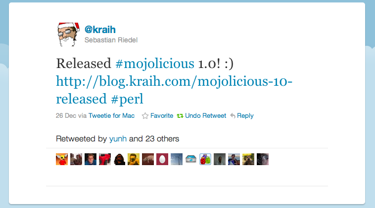

!SLIDE
# Mojolicious 1.0 #
## The web in a box ##

### Madrid.pm ###
### 23/03/2011 ###

!SLIDE transition=fade
# Mojolicious 1.x #
## Duct Tape For The HTML5 Web ##

### Madrid.pm ###
### 23/03/2011 ###

!SLIDE transition=scrollLeft

    @@@ Perl
    use Mojolicious::Lite;

    get '/' => sub { 
        shift->render( json => { 
            title    => 'Mojolicious 1.x', 
            subtitle => [ 
                'The web in a box', 
                'Duct Tape For The HTML5 Web' 
            ],
            where    => 'Madrid.pm',
            when     => '23/03/2011',
            who      => 'diegok'
        }); 
    };

    app->start;

!SLIDE center
# Autor #
## Sebastian Riedel ##

!SLIDE bullets incremental transition=scrollDown
# Se hizo cargo de Maypole #

* Quizo hacer cambios radicales
* **No le dejaron**

!SLIDE bullets incremental transition=scrollDown
# Creó Catalyst #

* Quizo hacer cambios radicales
* **No le dejaron**

!SLIDE bullets incremental transition=scrollDown
# Mojolicious #
## Pegamento para la web del presente/futuro ##

* Cada vez mas codigo en el cliente (JS)
* Cada vez menos codigo en el servidor 

!SLIDE center
# Mojolicious
## The box

!SLIDE smbullets transition=scrollUp
# Mojolicious #
## Features ##
* Framework web completo (MVC Server + Client)
* Modo simple ideal para prototipado (Mojolicious::Lite)
* Rutas RESTful
* Templates "perl-ish"
* Cookies firmadas
* Manejo de sesiones
* Internacionalizacion (i18n)
* Framework para testing

!SLIDE smbullets transition=scrollUp
# Mojolicious
## + Features

* HTTP 1.1
* Websockets / Comet / chunking
* Builtin async IO web server 
* Servidor de ficheros estáticos
* Hot deployment
* CGI / FastCGI / PSGI
* JSON y HTML5 parser con selectores CSS3

!SLIDE bullets transition=scrollUp
# Mojolicious #
## + Features ##

* Código limpio y orientado a objetos
* Solo depende de perl 5.8.7
* Pensado para que sea facil de migrar a perl6
* **Muy facil** de instalar

!SLIDE commandline incremental transition=scrollLeft
# Instalación de la última versión #

    $ curl -L cpanmin.us | perl - http://latest.mojolicio.us
    --> Working on http://latest.mojolicio.us
    Fetching http://latest.mojolicio.us ... OK
    Configuring kraih-mojo-765693b ... OK
    Building and testing http://latest.mojolicio.us ... OK
    Successfully installed http://latest.mojolicio.us

!SLIDE commandline transition=fade
# Instalación desde cpan #

    $ cpan Mojolicious
    ...

!SLIDE commandline incremental
# Crear una aplicacion "Lite" #

    $ mojo generate lite_app hello.pl
      [exist] /mojo_talk/examples
      [write] /mojo_talk/examples/hello.pl
      [chmod] hello.pl 744

!SLIDE
## hello.pl (1/2) ##
    @@@ Perl
    #!/usr/bin/env perl

    use Mojolicious::Lite;

    # Documentation browser under "/perldoc" 
    # (this plugin requires Perl 5.10)
    plugin 'pod_renderer';

    get '/welcome' => sub {
        my $self = shift;
        $self->render('index');
    };

    app->start;

    # continua ...
!SLIDE transition=scrollUp
## hello.pl (2/2) ##
    @@@ Perl
    __DATA__

    @@ index.html.ep
    % layout 'default';
    % title 'Welcome';
    Welcome to Mojolicious!

    @@ layouts/default.html.ep
    <!doctype html><html>
    <head><title><%= title %></title></head>
    <body><%== content %></body>
    </html>

!SLIDE commandline transition=fade
# Rutas #

    $./hello.pl routes
    /perldoc   (?-xism:^/perldoc)
    /welcome   (?-xism:^/welcome)

!SLIDE commandline incremental
# Run #

    $ ./hello.pl daemon --reload
    Server available at http://*:3000.

!SLIDE 
# + rutas para hello.pl #

    @@@ Perl
    get '/' => sub { 
        shift->render( text => 'Hello World!' ) 
    };

    get '/hello/:nombre' => sub { 
        my $self = shift;
        my $name = $self->param('nombre');
        $self->render( text => "Hello $name!" ); 
    };

    post '/hello' => sub {
        my $self = shift;
        my $name = $self->param('nombre');
        $self->render( text => "Hello $name!" ); 
    };

!SLIDE transition=fade
    @@@ Perl
    #!/usr/bin/env perl
    use Mojolicious::Lite;
    plugin 'pod_renderer';

    get '/welcome' => sub { shift->render('index') };
    get '/' => sub { 
        shift->render( text => 'Hello World!' ) 
    };
    get '/hello/:nombre' => \&hello;
    post '/hello'        => \&hello; 
    app->start;

    sub hello { 
        my $self = shift;
        my $name = $self->param('nombre');
        $self->render( text => "Hello $name!" ); 
    };

    __DATA__
    ...

!SLIDE commandline transition=fade

    $ ./hello.pl routes
    /perldoc         (?-xism:^/perldoc)
    /welcome         (?-xism:^/welcome)
    /                (?-xism:^(?:/)?)
    /hello/:nombre   (?-xism:^/hello/([^\/\.]+))
    /hello           (?-xism:^/hello)

!SLIDE
# Stash
    @@@ Perl
    get '/bar' => sub {
        my $self = shift;
        $self->stash(one => 23);
        $self->render('baz', two => 24);
    };

    __DATA__

    @@ baz.html.ep
    The magic numbers 
    are <%= $one %> and <%= $two %>.

!SLIDE
# Placeholders
    @@@ Perl
    # : <- todo menos / y .
    get '/(:captura)xx/foo' => \&show;

    # . <- todo menos /
    get '/(.captura)/hello' => \&show;
    
    # * <- todo
    get '/hello/(*captura)' => \&show;

    sub show { shift->render('groovy') };

    __DATA__

    @@ groovy.html.ep
    La ruta ha capturado: <%= $captura %>.

!SLIDE transition=scrollUp
# HTTP methods
    @@@ Perl
    get  '/bye' => sub { };
    post '/bye' => sub { };

    any [qw/get post delete/] => '/bye' => sub { 
        shift->render( text => 'bye!' ) 
    };

    any '/baz' => sub {
        my $self   = shift;
        my $method = $self->req->method;
        $self->render(
          text => "You called /baz with $method"
        );
    };

!SLIDE transition=fade
# Just router helpers
    @@@ Perl
    get '/foo/:bar' => sub {
        my $self = shift;
        my $bar  = $self->param('bar');
        $self->render( text => "Hello $bar!" );
    };

!SLIDE transition=fade
# The real mojo
    @@@ Perl
    app->routes->route('/foo/:bar')
       ->via('get')
       ->to(cb => sub {
            my $self = shift;
            my $bar  = $self->param('bar');
            $self->render( 
                text => "Hello $bar!" 
            );
       });

!SLIDE transition=scrollUp
# Route Constraints
    @@@ Perl
    # /* (digits)
    any '/:foo' => [foo => qr/\d+/] => sub {
        my $self = shift;
        my $foo  = $self->param('foo');
        $self->render(
            text => "Got digits -> $foo"
        );
    };

    # /* (everything else)
    any '/:bar' => [bar => qr/.*/] => sub {
        my $self = shift;
        my $bar  = $self->param('bar');
        $self->render( text => "Got -> $bar");
    };

!SLIDE transition=scrollUp
# Optional placeholder
## with default value
    @@@ Perl
    # /hello/*
    get '/hello/:name' 
        => {name => 'Madrid.pm'} => sub {
        my $self = shift;
        my $name = $self->param('name');
        $self->render( text => "Hello $name" );
    };

!SLIDE transition=scrollUp
# Un poco de todo
    @@@ Perl
    # /everything/*?name=*
    get '/everything/:stuff' 
        => [stuff => qr/\d+/] 
        => {stuff => 23} => sub {
            shift->render('welcome');
        };

    __DATA__

    @@ welcome.html.ep
    Stuff is <%= $stuff %>.
    Query param name is <%= param 'name' %>.

!SLIDE transition=scrollUp
# Condiciones
    @@@ Perl
    # /foo
    get '/foo' => (agent => qr/Firefox/) 
      => sub {
      shift->render(
        text => 'Congratulations, you are using a cool browser!'
      );
    };

    # /foo
    get '/foo' => (agent => qr/Internet Explorer/) 
    => sub {
      shift->render(
        text => 'You need to upgrade to Firefox!'
      );
    };

!SLIDE
# under

    @@@ Perl
    under sub => {
        # return true or false
    };

!SLIDE transition=scrollUp
    @@@ Perl
    # Authenticate based on name parameter
    under sub {
        my $self = shift;
        my $name = $self->param('name') || '';
        return 1 if $name eq 'Bender';
        $self->render('denied');
        return;
    };
    # GET / (with authentication)
    get '/' => 'index';
    app->start;
    __DATA__;

    @@ denied.html.ep
    You are not Bender, permission denied!

    @@ index.html.ep
    Hi Bender!

!SLIDE transition=scrollUp
    @@@ Perl
    use Mojolicious::Lite;

    # /foo
    under '/foo';

    # GET /foo/bar
    get '/bar' => sub { 
        shift->render(text => 'bar!') 
    };

    # GET /foo/baz
    get '/baz' => sub { 
        shift->render(text => 'baz!') 
    };

    app->start;

!SLIDE
# Session
## Client side
### Signed cookie

!SLIDE transition=scrollUp
# Session
    @@@ Perl
    app->secret('para la cookie');

    under sub {
        if ( $self->session('user') ) {
            return 1;
        }
        elsif ( my $user = $self->param('u') ) {
            $self->session(user => $user);
            return 1;
        }
        return 0;
    }

!SLIDE
# Websockets
    @@@ Perl
    websocket '/echo' => sub {
        my $self = shift;
        $self->on_message(sub {
            my ($self, $message) = @_;
            $self->send_message("echo: $message");
        });
    };

!SLIDE
# Client inside
    @@@ Perl
    use Mojolicious::Lite;

    # Scrape information from remote sites
    post '/title' => sub {
        my $self = shift;
        my $url  = $self->param('url') 
                 || 'http://mojolicio.us';

        $self->render( text 
            => $self->ua->get($url)->res
                    ->dom->at('head > title')
                    ->text
        );
    };

!SLIDE
# Renderer

!SLIDE transition=scrollUp
## Renderer explicito
    @@@ Perl
    # 200 OK, text/plain, 'Hello!'
    {text => 'Hello!'} 

    # 200 OK, application/json, '{"x":3}'
    {json => {x => 3}} 

    # 410 Gone, text/plain, 'Oops!'
    {text => 'Oops!', status => '410'}

!SLIDE transition=scrollUp
## Renderer por defecto
    @@@ Perl
    # users/list.html.ep
    {controller => 'users', action => 'list'}

    # foo.txt.ep
    {route => 'foo', format => 'txt'}  

    # foo.html.epl
    {route => 'foo', handler => 'epl'} 

!SLIDE
# Templates

!SLIDE transition=scrollUp
# Templates
## .ep
    @@@ Perl
    <% Inline Perl %>
    <%= Expresión perl como "scaped XML" %>
    <%== Expresión perl raw %>
    <%# Comment, useful for debugging %>
    % Perl line
    %= Perl expression line, XML escaped result
    %== Perl expression line, raw result
    %# Comment line, useful for debugging

!SLIDE transition=scrollUp
# Templates
## .ep
    @@@ html
    <!doctype html>
    <html>
      <head>
        <title>Time</title>
      </head>
      <body><%= localtime time %></body>
    </html>

!SLIDE transition=scrollUp
# Templates
## .ep
    @@@ Perl
    <% for my $framework (@$frameworks) { %>
        <%= $framework %> by <%= $author %>.
    <% } %>

    <% while (my ($app, $desc) = each %$hr) { %>
        <%= $app %> is a <%= $description %>.
    <% } %>

!SLIDE transition=scrollUp
# Default Helpers
## Mojolicous::Plugin::DefaultHelpers
### .ep
    @@@ Perl
    <%= dumper [1, 2, 3] %>
    <%= stash 'xxx' %>
    <%= $xxx %>

### Controller
    @@@ Perl
    my $serialized = $self->dumper([1, 2, 3]);
    $self->stash( xxx => 23 );

!SLIDE transition=scrollUp
# Tag Helpers
## Mojolicous::Plugin::TagHelpers
    @@@ Perl
    <%= tag 'div' %>
    <%= tag 'div', id => 'foo' %>
    <%= tag div => begin %>Content<% end %>

    <%= javascript 'script.js' %>
    <%= stylesheet 'foo.css' %>
    
    <%= form_for login => (method => 'post') => begin %>
        <%= text_field 'first_name' %>
        <%= check_box employed => 1, id => 'foo' %>
        <%= submit_button %>
    <% end %>

!SLIDE transition=scrollUp
# Tag Helpers (cont.)
## Mojolicous::Plugin::TagHelpers
    @@@ Perl
    <%= link_to Home => 'index' %>
    <%= link_to index => begin %>Home<% end %>

    <%= link_to index => {foo => 'bar'} 
        => (class => 'links') => begin %>
        Home
    <% end %>

    <%= link_to '/file' => begin %>File<% end %>

    <%= link_to url_for->query(foo => $foo) 
        => begin %> Retry <% end %>

!SLIDE bullets transition=scrollUp
# Template plugins

* MojoX::Renderer::TT
* MojoX::Renderer::Mason
* MojoX::Renderer::Xslate
* MojoX::Renderer::Alloy
* MojoX::Renderer::YAML
* MojoX::Renderer::XSLT

!SLIDE
# Mojo::DOM
## HTML5 DOM parser
## CSS3 selectors

!SLIDE transition=scrollUp
# Mojo::DOM
    @@@ Perl
    my $dom = Mojo::DOM->new;
    $dom->parse('
...
');

    # Find
    say $dom->at('div#header');

    # Iterate
    $dom->find('div[id]')
        ->each(sub { say shift->text });

    # Loop
    say $e->text for $dom->find('div[id]')->each;

!SLIDE transition=scrollUp
# Mojo::DOM
    @@@ Perl
    # Selectors++
    $dom->find('a[href*="pm"]')
        ->each(sub { say shift->text });

    # Get the first 10 links
    $dom->find('a[href]')->while(sub { 
        say shift->attrs->{href} if pop < 10; 
    });

    # Search for a link about a specific topic
    $dom->find('a[href]')->until(sub { 
        say $_->attrs->{href} 
         if $_->text =~ m/mojo/; 
    });

!SLIDE
# Mojo::UserAgent
## (ex Mojo::Client)
## Async IO HTTP 1.1 
## WebSocket Client

!SLIDE transition=scrollUp
# Mojo::UserAgent
    @@@ Perl
    my $ua = Mojo::UserAgent->new;

    # Grab the latest Mojolicious release :)
    print $ua
          ->max_redirects(3)
          ->get('http://latest.mojolicio.us')
          ->res->body;

    # Quick JSON request
    say $ua
        ->get('http://search.twitter.com/trends.json')
        ->res->json->{trends}->[0]->{name};

!SLIDE transition=scrollUp
# Mojo::UserAgent
## Scrap!
    @@@ Perl
    # Extract data from HTML and XML resources
    say $ua->get('mojolicio.us')
           ->res->dom->at('title')->text;

    # Scrape the latest headlines
    $ua->get('http://digg.com')->res
       ->dom('h3 > a.story-title')
       ->each(sub {
           say shift->text . "\n";
       }
    );

!SLIDE transition=scrollUp
# Mojo::UserAgent
## Form POST
    @@@ Perl
    # Form post with exception handling
    my $tx = $ua->post_form(
        'http://search.cpan.org/search' 
         => { q => 'mojo' }
    );
    if (my $res = $tx->success) { 
        say $res->body; 
    }
    else {
        my ($message, $code) = $tx->error;
        say "Error: $message ($code)";
    }

!SLIDE transition=scrollUp
# Mojo::UserAgent
## Parallel requests
    @@@ Perl
    # Parallel requests
    my $callback = sub { 
        print pop->res->body 
    };

    $ua->get( 
        'http://mojolicio.us'    => $callback
    );
    $ua->get(
        'http://search.cpan.org' => $callback
    );

    $Mojo::IOLoop->start;

!SLIDE transition=scrollUp
# Mojo::UserAgent
## Websocket request
    @@@ Perl
    $ua->websocket(
        'ws://localhost:3000' => sub {
            my $tx = pop;
            $tx->on_message( sub {
                my ($tx, $message) = @_;
                say $message;
            });
            $tx->on_finish(sub { Mojo::IOLoop->stop });
            $tx->send_message('hi there!');
        }
    );

    Mojo::IOLoop->start;

!SLIDE
# Testing
## Test::Mojo
### ( Mojo::UserAgent + Mojo::DOM )

!SLIDE transition=scrollUp
# Testing
### t/myapp.pl

    @@@ Perl
    use Test::More tests => 3;
    use Test::Mojo;

    use FindBin;
    $ENV{MOJO_HOME} = "$FindBin::Bin/../";
    require "$ENV{MOJO_HOME}/myapp.pl";

    my $t = Test::Mojo->new;
    $t->get_ok('/')
      ->status_is(200)
      ->content_like(qr/Funky!/);

!SLIDE transition=scrollUp
# Testing
### t/myapp.pl

    @@@ Perl
    use Test::More tests => 3;
    use Test::Mojo;

    use FindBin;
    $ENV{MOJO_HOME} = "$FindBin::Bin/../";
    require "$ENV{MOJO_HOME}/myapp.pl";

    my $t = Test::Mojo->new;
    $t->get_ok('/fun')
      ->status_is(200)
      ->text_like(
        'div#main > h1' => qr/fun/, 
        'Title has fun!'
      );

!SLIDE
# Oneliners
## ojo.pm

!SLIDE transition=scrollUp
# ojo.pm

    @@@ Perl
    a => Mojolicious::Lite
    b => Mojo::ByteStream
    d => DELETE
    f => POST form
    g => GET
    h => HEAD
    p => POST
    u => PUT
    w => websocket
    x => Mojo::DOM

## http://mojolicio.us/perldoc?ojo

!SLIDE commandline transition=scrollUp
# ojo.pm 
## GET

    $ perl -Mojo -E 'g("http://perldoc.perl.org/")->dom("h1")
    $                ->each(sub { say pop, ". ",shift->text })'
    1. Perl programming documentation
    2. Perl 5 version 12.2 documentation

!SLIDE commandline transition=scrollUp
# ojo.pm 
## POST form

    $ perl -Mojo -E 'f("http://forms.com/" => {option => 3})
    $                ->res->dom->at(".result")->text'

!SLIDE commandline transition=scrollUp
# ojo.pm
## Instant lite_app

    $ perl -Mojo -e 'a("/" => {text => "Hello!"})->start' daemon

!SLIDE commandline transition=scrollUp
# ojo.pm
## x
### Mojo::DOM

    $ perl -Mojo -E "say x('
Hello!
')->at('div')->text"

!SLIDE transition=toss
# Command line
## mojo get

!SLIDE commandline transition=scrollUp
# Command line

    $ mojo get http://mojolicio.us 'head > title'
    <title>Mojolicious Web Framework - Join the Perl revolution!</title>

!SLIDE commandline transition=scrollUp
# Command line

    $ mojo get http://mojolicio.us '*' attr id
    banner
    mojobar
    mojobar-logo
    mojobar-links
    introduction
    footer

!SLIDE commandline transition=scrollUp
# Command line

    $ mojo get http://mojolicio.us 'h1, h2, h3' text
    A next generation web framework for the Perl programming language.
    Features
    Installation
    Duct Tape For The HTML5 Web
    Growing
    Want to know more?

!SLIDE commandline transition=scrollUp
# Command line

    $ mojo get http://mojolicio.us 'h1, h2, h3' 3 text
    Duct Tape For The HTML5 Web

!SLIDE transition=toss
# Mojolicious
## App

!SLIDE commandline transition=scrollUp
    $ mojolicious generate app MyApp
    [mkdir] my_app/script
    [write] my_app/script/my_app
    [chmod] my_app/script/my_app 744
    [mkdir] my_app/lib
    [write] my_app/lib/MyApp.pm
    [mkdir] my_app/lib/MyApp
    [write] my_app/lib/MyApp/Example.pm
    [mkdir] my_app/t
    [write] my_app/t/basic.t
    [mkdir] my_app/log
    [mkdir] my_app/public
    [write] my_app/public/index.html
    [mkdir] my_app/templates/layouts
    [write] my_app/templates/layouts/default.html.ep
    [mkdir] my_app/templates/example
    [write] my_app/templates/example/welcome.html.ep

!SLIDE transition=fade
    @@@ Perl
    .
    |-- lib
    |   |-- MyApp
    |   |   `-- Example.pm
    |   `-- MyApp.pm
    |-- log
    |-- public
    |   `-- index.html
    |-- script
    |   `-- my_app
    |-- t
    |   `-- basic.t
    `-- templates
        |-- example
            |   `-- welcome.html.ep
                `-- layouts
                        `-- default.html.ep

!SLIDE transition=scrollUp
# Controller

    @@@ Perl
    package MyApp::Example;
    use strict;
    use warnings;
    use base 'Mojolicious::Controller';

    # This action will render a template
    sub welcome {
        my $self = shift;

        # Render template "example/welcome.html.ep" with message
        $self->render(message => 'Welcome to the Mojolicious Web Framework!');
    }
    1;

### lib/MyApp/Example.pm

!SLIDE transition=scrollUp
# App / Rutas
    @@@ Perl
    package MyApp;
    use strict; use warnings;
    use base 'Mojolicious';

    sub startup {
        my $self = shift;
        $self->plugin('pod_renderer');
        # Routes
        my $r = $self->routes;
        $r->route('/welcome')
          ->to('example#welcome', id => 1);
    }
    1;

### lib/MyApp.pm

!SLIDE center
# Deployment

!SLIDE transition=fade
# Mojo::Server::Hypnotoad
Mojo::Server::Hypnotoad is a full featured **UNIX optimized** preforking async io HTTP 1.1 and WebSocket server built around the very well tested and reliable Mojo::Server::Daemon with TLS, Bonjour, epoll, kqueue and **hot deployment** support that just works.

!SLIDE commandline incremental transition=scrollUp
# All glory to the hypnotoad

    $ hypnotoad hello.pl
    Server available at http://*:8080.

!SLIDE transition=scrollUp
# Mojo::Server::Hypnotoad
## hypnotoad.conf

    @@@ Perl
    {listen => ['http://*:8080'], workers => 4};

## ( mojo generate hypnotoad )

!SLIDE transition=scrollUp
## Nginx

    @@@ Perl
    upstream myapp {
        server 127.0.0.1:8080;
    }
    server {
        listen 80;
        server_name localhost;
        location / {
            proxy_read_timeout 300;
            proxy_pass http://myapp;
            proxy_set_header Host $http_host;
            proxy_set_header 
                X-Forwarded-For 
                $proxy_add_x_forwarded_for;
        }
    }

!SLIDE transition=scrollUp
##INT, TERM
###Shutdown server immediately

##QUIT
###Shutdown server gracefully.

##TTIN
###Increase worker pool by one.

##TTOU
###Decrease worker pool by one.

##USR2
###Attempt zero downtime software upgrade (hot deployment) without losing any incoming connections.

!SLIDE transition=toss
# Documentación
## http://mojolicio.us/perldoc
## https://github.com/kraih/mojo/wiki

!SLIDE transition=fade
# Gracias!
