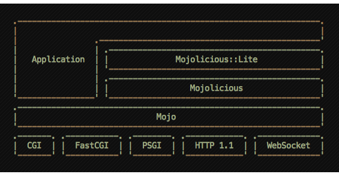
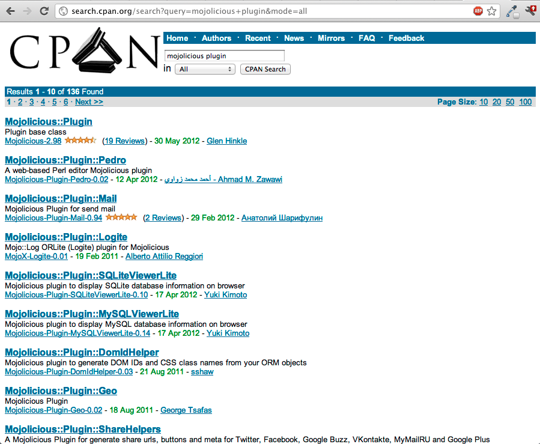

!SLIDE
# Mojolicious
## The web in a box

### Barcelona.pm

### 28/06/2012

!SLIDE transition=fade
# Hello!

## Diego Kuperman
## @freekey

### https://github.com/diegok
### https://metacpan.org/author/DIEGOK

!SLIDE transition=scrollLeft

    @@@ Perl
    use Mojolicious::Lite;

    get '/' => sub { 
      shift->render( json => { 
        title    => 'Mojolicious', 
        subtitle => [ 
          'The web in a box', 
          'Duct Tape For The HTML5 Web' 
        ],
        where    => 'Barcelona on rails',
        when     => '21/06/2012',
        who      => 'diegok / @freekey'
      }); 
    };

    app->start;

!SLIDE bullets incremental transition=scrollUp
# Mojolicious
## What's in the box?
* Full framework (client and server)
* Mojo::UserAgent (client)
* Mojolicious::Lite (micro)
* Mojolicious (full) 
* No dependencies besides perl 5.10

!SLIDE bullets incremental transition=scrollUp
# Mojolicious
## Bleeding edge

* Non-blocking events
* Concurrent requests
* Websockets
* IPv6

!SLIDE bullets incremental transition=scrollUp
# Mojolicious
## No more than the web in the box

* model agnostic
* validation agnostic
* minimal core
* CPAN lover

!SLIDE bullets incremental transition=scrollUp
# Mojolicious
## Clean, well tested and well documented code

* < 10k LOC
* ~ 17k lines of tests
* ~ 9k unit tests
* Not a feature until it's well tested

!SLIDE center transition=fade

!SLIDE center
# Mojolicious
## The box

!SLIDE commandline transition=scrollLeft
# Install

    $ curl get.mojolicio.us | sh

!SLIDE commandline incremental transition=fade
# Install from CPAN

    $ cpanm Mojolicious
    --> Working on Mojolicious
    Fetching http://www.cpan.org/authors/id/T/TE/TEMPIRE/Mojolicious-2.98.tar.gz ... OK
    Configuring Mojolicious-2.98 ... OK
    Building and testing Mojolicious-2.98 ... OK
    Successfully reinstalled Mojolicious-2.98
    1 distribution installed

!SLIDE
# Client

!SLIDE transition=fade
# Mojo::UserAgent
### Async IO HTTP 1.1 
### WebSocket Client
## +
# Mojo::DOM
### HTML5 DOM parser
### CSS3 selectors

!SLIDE transition=scrollUp
# Mojo::UserAgent
    @@@ Perl
    my $ua = Mojo::UserAgent->new;

    # Grab the Mojolicious homepage :)
    $ua->get('http://mojolicio.us')->res->body;

    # Quick JSON request
    $ua->get('http://search.twitter.com/search.json?q=mojolicious')
       ->res->json->{results}[0]{text};

!SLIDE transition=scrollUp
# Mojo::UserAgent
## Scrap!

    @@@ Perl
    # Mojolicious - Perl real-time web framework
    say $ua->get('mojolicio.us')
           ->res->dom->at('title')->text;

!SLIDE transition=scrollUp
# Mojo::UserAgent
## Scrap!

    @@@ Perl
    # Scrape the latest headlines
    $ua->get('http://digg.com')->res
       ->dom('h3.story-item-title > a')
       ->each(sub { say shift->text });

!SLIDE transition=scrollUp
# Mojo::UserAgent
## Form POST

    @@@ Perl
    # Form post with exception handling
    my $tx = $ua->post_form(
      'http://search.cpan.org/search' 
       => { q => 'mojo' }
    );
    if (my $res = $tx->success) { 
      say $res->body; 
    }
    else {
      my ($message, $code) = $tx->error;
      say "Error: $message ($code)";
    }

!SLIDE transition=scrollUp
# Mojo::UserAgent
## Parallel requests

    @@@ Perl
    my $ua = Mojo::UserAgent->new;

    my $cb = sub { print pop->res->body };

    $ua->get('http://mojolicio.us'    => $cb);
    $ua->get('http://search.cpan.org' => $cb);

    Mojo::IOLoop->start;

!SLIDE transition=scrollUp
# Mojo::UserAgent
## Blocking parallel requests

    @@@ Perl
    my $delay = Mojo::IOLoop->delay;
    for my $url ('mojolicio.us', 'cpan.org') {
      $delay->begin;
      $ua->get($url => sub {
        my ($ua, $tx) = @_;
        $delay->end(
          $tx->res->dom->at('title')->text
        );
      });
    }
    my @titles = $delay->wait;

!SLIDE transition=scrollUp
# Mojo::UserAgent
## Non-blocking WebSocket connection

    @@@ Perl
    $ua->websocket('ws://ws.org:8787' => sub {
      my ($ua, $tx) = @_;
      $tx->on(finish => sub { say 'WS closed!' });
      $tx->on(message=> sub {
        my ($tx, $message) = @_;
        say "WebSocket message: $message";
        $tx->finish;
      });
      $tx->send('hi there!');
    });
    Mojo::IOLoop->start unless Mojo::IOLoop->is_running;

!SLIDE
# Commandline client
## mojo get

!SLIDE commandline incremental transition=scrollUp
# Commandline

    $ mojo get http://barcelonaonrails.com
    <!DOCTYPE html PUBLIC "-//W3C//DTD XHTML 1.0 Transitional//EN"
         "http://www.w3.org/TR/xhtml1/DTD/xhtml1-transitional.dtd">
    ...

    $ mojo get http://barcelonaonrails.com title
    <title> Barcelona on Rails</title>

    $ mojo get http://barcelonaonrails.com title text
     Barcelona on Rails

    $ mojo get http://barcelonaonrails.com 'h1 span'
    Barcelona on Rails

    $ mojo get http://twitter.com/search.json?q=mojo '/completed_in'
    0.024

!SLIDE commandline incremental transition=scrollUp
# Commandline

    $ mojo get -v http://barcelonaonrails.com title
    GET / HTTP/1.1
    User-Agent: Mojolicious (Perl)
    Content-Length: 0
    Host: barcelonaonrails.com

    HTTP/1.1 200 OK
    Connection: keep-alive
    Cache-Control: max-age=0, private, must-revalidate
    Status: 200 OK
    Transfer-Encoding: chunked
    Date: Wed, 20 Jun 2012 21:45:34 GMT
    X-UA-Compatible: IE=Edge,chrome=1
    ETag: "0d78276580a9f5a5d3d836122902786b"
    X-Runtime: 0.034635
    Content-Type: text/html; charset=utf-8
    Server: nginx

    Barcelona on Rails

!SLIDE transition=fade
# Debug Mojo::UserAgent
## MOJO\_USERAGENT\_DEBUG=1

!SLIDE
# Mojolicious::Lite
## Microframework / Lite framework
## Full power!

!SLIDE transition=fade
# Mojolicious::Lite

* One file
* Getting started
* Prototyping
* Small apps
* Embed

!SLIDE commandline incremental
# Commandline helper

    $ mojo generate lite_app hello
      [exist] /mojo_talk/examples
      [write] /mojo_talk/examples/hello
      [chmod] hello 744

!SLIDE
## hello (1/2) ##

    @@@ Perl
    #!/usr/bin/env perl
    use Mojolicious::Lite;

    # Documentation browser under "/perldoc"
    plugin 'PODRenderer';

    get '/' => sub {
      my $self = shift;
      $self->render('index');
    };

    app->start;

    # ...

!SLIDE transition=scrollUp
## hello (2/2) ##

    @@@ Perl
    __DATA__

    @@ index.html.ep
    % layout 'default';
    % title 'Welcome';
    Welcome to the Mojolicious real-time web framework!

    @@ layouts/default.html.ep
    <!DOCTYPE html>
    <html>
      <head><title><%= title %></title></head>
      <body><%= content %></body>
    </html>

!SLIDE commandline transition=fade
# Routes inspection

    $ ./hello routes
    /perldoc/*module  *    perldocmodule
    /                 GET               

!SLIDE commandline incremental
# Run

    $ morbo hello
    Server available at http://*:3000.

!SLIDE 
# Other hello app

    @@@ Perl
    #!/usr/bin/env perl
    use Mojolicious::Lite;

    get '/' => sub {
        shift->render( text => 'Hello World!' )
    };
    get '/hello/:name' => \&hello;
    post '/hello'      => \&hello;

    sub hello {
        my $self = shift;
        my $name = $self->param('name');
        $self->render_text("Hello $name!");
    };

    app->start;

!SLIDE commandline transition=fade
# Routes with names

    $ ./hello routes
    /             GET            
    /hello/:name  GET   helloname
    /hello        POST  hello

!SLIDE
# Route placeholders

    @@@ Perl
    # all but / and .
    get '/:capture/foo' => \&show;

    # all but /
    get '/#capture/hello' => \&show;
    
    # all
    get '/hello/*capture' => \&show;

    sub show { shift->render('groovy') };

    __DATA__

    @@ groovy.html.ep
    Got from route: <%= $capture %>.

!SLIDE transition=scrollUp
# HTTP methods
    @@@ Perl
    get  '/bye' => sub { };
    post '/bye' => sub { };

    any [qw/get post delete/] => '/bye' => sub { 
        shift->render( text => 'bye!' ) 
    };

    any '/baz' => sub {
        my $self   = shift;
        my $method = $self->req->method;
        $self->render(
          text => "You called /baz with $method"
        );
    };

!SLIDE
# Just router helpers
    @@@ Perl
    get '/foo/:bar' => sub {
        my $self = shift;
        my $bar  = $self->param('bar');
        $self->render( text => "Hello $bar!" );
    };

!SLIDE transition=fade
# The real mojo
    @@@ Perl
    app->routes->route('/foo/:bar')
       ->via('get')
       ->to(cb => sub {
            my $self = shift;
            my $bar  = $self->param('bar');
            $self->render( 
                text => "Hello $bar!" 
            );
       });

!SLIDE transition=scrollUp
# Route Constraints
    @@@ Perl
    # /* (digits)
    any '/:foo' => [foo => qr/\d+/] => sub {
        my $self = shift;
        my $foo  = $self->param('foo');
        $self->render_text("Got: $foo");
    };

    # /* (everything else)
    any '/:bar' => [bar => qr/.*/] => sub {
        my $self = shift;
        $self->render_json({ 
          got => $self->param('bar') 
        });
    };

!SLIDE transition=scrollUp
# Optional placeholder
## with default value
    @@@ Perl
    # /hello/*
    get '/:name' => {name=>'world!'} => sub {
        my $self = shift;
        my $name = $self->param('name');
        $self->render( text => "Hello $name" );
    };

!SLIDE transition=scrollUp
# Conditions
    @@@ Perl
    # /foo
    get '/foo' => (agent => qr/Firefox/) 
      => sub {
      shift->render(
        text => 'You are using a cool browser!'
      );
    };

    # /foo
    get '/foo' => (agent => qr/Internet Explorer/) 
    => sub {
      shift->render(
        text => 'You need to upgrade your browser!'
      );
    };

!SLIDE transition=scrollUp
# All together...

    @@@ Perl
    # /everything/*?name=*
    get '/everything/:stuff' 
        => [stuff => qr/\d+/] 
        => {stuff => 23} => sub {
            shift->render('welcome');
        };

    __DATA__

    @@ welcome.html.ep
    Stuff is <%= $stuff %>.
    Query param name is <%= param 'name' %>.

!SLIDE
# under

    @@@ Perl
    under sub => {
        # return true or false
    };

!SLIDE transition=scrollUp
    @@@ Perl
    # Authenticate based on name parameter
    under sub {
        my $self = shift;
        my $name = $self->param('name') || '';
        return 1 if $name eq 'Bender';
        $self->render('denied');
        return;
    };
    # GET / (with authentication)
    get '/' => 'index';
    app->start;
    __DATA__;

    @@ denied.html.ep
    You are not Bender, permission denied!

    @@ index.html.ep
    Hi Bender!

!SLIDE transition=scrollUp
    @@@ Perl
    use Mojolicious::Lite;

    # /foo
    under '/foo';

    # GET /foo/bar
    get '/bar' => sub { 
        shift->render(text => 'bar!') 
    };

    # GET /foo/baz
    get '/baz' => sub { 
        shift->render(text => 'baz!') 
    };

    app->start;

!SLIDE
# EP Templates

!SLIDE transition=scrollUp
# Templates
## .ep
    @@@ Perl
    <% Inline Perl %>
    <%= perl expression as "scaped XML" %>
    <%== Raw perl expression %>
    <%# Comment, useful for debugging %>
    % Perl line
    %= Perl expression line, XML escaped result
    %== Perl expression line, raw result
    %# Comment line, useful for debugging

!SLIDE transition=scrollUp
# Templates
## .ep
    @@@ Perl
    <% for my $framework (@$frameworks) { %>
        <%= $framework %> by <%= $author %>.
    <% } %>

    <% while (my ($app, $desc) = each %$hr) { %>
        <%= $app %> is a <%= $description %>.
    <% } %>

!SLIDE bullets transition=scrollUp
# Template plugins

* MojoX::Renderer::TT
* MojoX::Renderer::Mason
* MojoX::Renderer::Xslate
* MojoX::Renderer::Alloy
* MojoX::Renderer::YAML
* MojoX::Renderer::XSLT
* MojoX::Renderer::HAML

!SLIDE
# Helpers

!SLIDE
# Mojolicious::Plugin::DefaultHelpers

## app  config  content
## content\_for  current\_route
## dumper  extends  flash
## include  layout  memorize
## param  session  stash
## title  url\_for  url\_with

!SLIDE
# stash, param & dumper
    @@@ Perl
    get '/bar' => sub {
        my $self = shift;
        $self->stash(one => 23);
        $self->render('baz', two => 24);
    };

    __DATA__

    @@ baz.html.ep
    The magic numbers are <%= $one %> and <%= $two %>.
    <%= param 'name' %>
    <%= stash 'one' %>
    <%= dumper [1, 2, 3] %>

!SLIDE
# Mojolicious::Plugin::TagHelpers
## base\_tag check\_box file\_field 
## form\_for hidden\_field image input\_tag
## javascript link\_to password\_field
## radio\_button select\_field
## stylesheet submit\_button t tag
## text\_field text\_area

!SLIDE transition=scrollUp
# Tag Helpers
## Mojolicous::Plugin::TagHelpers
    @@@ Perl
    %= tag 'div';
    <%= t 'div', id => 'foo' %>
    <%= t div => begin %>Content<% end %>

    %= image '/images/foo.png', alt => 'Foo'

    <%= javascript 'script.js' %>
    <%= stylesheet 'foo.css' %>
    
    <%= form_for login => begin %>
        %= text_field 'first_name';
        %= check_box employed => 1, id => 'foo';
        %= submit_button;
    <% end %>

!SLIDE transition=scrollUp
# Tag Helpers (cont.)
## Mojolicous::Plugin::TagHelpers
    @@@ Perl
    <%= link_to Home => 'index' %>

    <%= link_to index => {foo => 'bar'}, class => 'links' => begin %>
      Home
    <% end %>

    <%= link_to '/file' => begin %>File<% end %>

    <%= link_to url_with->query([page => $cur++]) => begin %>Next<% end %>

!SLIDE
# Helpers creation

    @@@ Perl
    helper mydump => sub {
      my ( $self, @values ) = @_;
      Data::Dumper->new(\@values)->Dump;
    };

!SLIDE transition=fade
# Plugin creation

    @@@ Perl
    package Mojolicious::Plugin::MyDump;
    use base 'Mojolicious::Plugin';

    sub register {
      my ($self, $app) = @_;

      $app->helper(mydump => sub {
        my ( $self, @values ) = @_;
        Data::Dumper->new(\@values)->Dump;
      });
    }

    1;

!SLIDE
# Core plugins
## are very good examples

!SLIDE transition=fade
# Mojolicious::Plugin::Mount

    @@@ Perl
    # Mojolicious
    my $route = $self->plugin(Mount => {
      '/prefix' => '/apps/myapp.pl'
    });

    # Mojolicious::Lite
    my $route = plugin Mount => {
      '/prefix' => '/apps/myapp.pl'
    };

!SLIDE
# Plugins on CPAN

!SLIDE
# Session
## Client side
### Signed cookie

!SLIDE transition=scrollUp
# Session
    @@@ Perl
    app->secret('my super secret ftw!');

    under sub {
      if ( $self->session('user') ) {
        return 1;
      }
      elsif ( my $user = $self->param('u') ) {
        $self->session(user => $user);
        return 1;
      }
      return 0;
    }

!SLIDE
# Commandline / Oneliners
## ojo

!SLIDE commandline transition=scrollUp
# ojo.pm
## Instant lite_app

    $ perl -Mojo -e 'a("/" => {text => "Hello!"})->start' daemon

!SLIDE commandline transition=scrollUp
# ojo.pm
## Instant lite_app

    $ perl -Mojo -e 'a("/" => {text => "Hello!"})->start' get /

!SLIDE transition=scrollUp
# ojo.pm

    @@@ Perl
    a => Mojolicious::Lite
    b => Mojo::ByteStream
    c => Mojo::Collection
    d => DELETE
    f => POST form
    g => GET
    h => HEAD
    o => OPTIONS request
    p => POST
    t => PATCH
    u => PUT
    x => Mojo::DOM

## http://mojolicio.us/perldoc?ojo

!SLIDE
# Async examples

!SLIDE

# Websockets

    @@@ Perl
    websocket '/echo' => sub {
        my $self = shift;
        $self->on(message=>sub {
            my ($self, $message) = @_;
            $self->send_message("echo: $message");
        });
    };

!SLIDE
# Client inside
    @@@ Perl
    use Mojolicious::Lite;

    # Scrape information from remote sites
    get '/title-from' => sub {
      my $self = shift;
      my $url  = $self->param('url')
               || 'http://mojolicio.us';

      $self->ua->get($url => sub {
        my $dom = pop->res->dom;
        $self->render_text(
          $dom->at('title')->text
        );
      });
      $self->render_later;
    };

    app->start;

!SLIDE transition=fade
# Mojolicious::Plugin::Proxy

    @@@ Perl
    use Mojolicious::Lite;

    plugin 'proxy';
     
    get '/' => sub { 
      shift->proxy_to('http://mojolicio.us/') 
    };

    app->start;

!SLIDE
# Testing
## Test::Mojo
### ( Mojo::UserAgent + Mojo::DOM )

!SLIDE transition=scrollUp

    @@@ Perl
    use Test::More tests => 12;
    use Test::Mojo;

    my $t = Test::Mojo->new('MyApp');

    $t->get_ok('/welcome')
      ->status_is(200)
      ->text_is('div#message' => 'Hello!');

    $t->post_form_ok('/search.json' => {q => 'Perl'})
      ->status_is(200)
      ->header_is('X-Powered-By' => 'Mojolicious (Perl)')
      ->header_isnt('X-Bender' => 'Bite my shiny metal ass!');
      ->json_is('/results/4/title' => 'Perl rocks!');

    $t->websocket_ok('/echo')
      ->send_ok('hello')
      ->message_is('echo: hello')
      ->finish_ok;

!SLIDE transition=toss
# Mojolicious
## App

!SLIDE commandline transition=scrollUp
    $ mojo generate app MyApp
      [mkdir] /.../my_app/script
      [write] /.../my_app/script/my_app
      [chmod] my_app/script/my_app 744
      [mkdir] /.../my_app/lib
      [write] /.../my_app/lib/MyApp.pm
      [mkdir] /.../my_app/lib/MyApp
      [write] /.../my_app/lib/MyApp/Example.pm
      [mkdir] /.../my_app/t
      [write] /.../my_app/t/basic.t
      [mkdir] /.../my_app/log
      [mkdir] /.../my_app/public
      [write] /.../my_app/public/index.html
      [mkdir] /.../my_app/templates/layouts
      [write] /.../my_app/templates/layouts/default.html.ep
      [mkdir] /.../my_app/templates/example
      [write] /.../my_app/templates/example/welcome.html.ep

!SLIDE transition=fade
    @@@ Perl
    .
    |-- lib
    |   |-- MyApp
    |   |   `-- Example.pm
    |   `-- MyApp.pm
    |-- log
    |-- public
    |   `-- index.html
    |-- script
    |   `-- my_app
    |-- t
    |   `-- basic.t
    `-- templates
        |-- example
            |   `-- welcome.html.ep
                `-- layouts
                        `-- default.html.ep

!SLIDE transition=scrollUp
# Controller

    @@@ Perl
    package MyApp::Example;
    use strict;
    use warnings;
    use base 'Mojolicious::Controller';

    # This action will render a template
    sub welcome {
        my $self = shift;

        # Render template "example/welcome.html.ep" with message
        $self->render(message => 'Welcome perl6!');
    }
    1;

### lib/MyApp/Example.pm

!SLIDE transition=scrollUp
# App context and startup

    @@@ Perl
    package MyApp;
    use strict; use warnings;
    use base 'Mojolicious';

    sub startup {
        my $self = shift;
        $self->plugin('pod_renderer');
        # Routes
        my $r = $self->routes;
        $r->route('/welcome')
          ->to('example#welcome', id => 1);
    }
    1;

### lib/MyApp.pm

!SLIDE center
# Deployment

!SLIDE transition=fade
# Mojo::Server::Hypnotoad
Mojo::Server::Hypnotoad is a full featured **UNIX optimized** preforking
**non-blocking I/O** HTTP 1.1 and **WebSocket** server built around the very
well tested and reliable Mojo::Server::Daemon with IPv6, TLS, libev and
**hot deployment** support that **just works**.

!SLIDE commandline incremental transition=scrollUp
# All glory to the hypnotoad
## start

    $ hypnotoad hello

!SLIDE commandline incremental transition=scrollUp
# All glory to the hypnotoad
## Hot restart

    $ hypnotoad hello
    Starting hot deployment for Hypnotoad server 31912
    
!SLIDE commandline incremental transition=scrollUp
# All glory to the hypnotoad
## stop

    $ hypnotoad -s hello
    Stopping Hypnotoad server 31954 gracefully.
    
!SLIDE transition=scrollUp
##INT, TERM
###Shutdown server immediately

##QUIT
###Shutdown server gracefully.

##TTIN
###Increase worker pool by one.

##TTOU
###Decrease worker pool by one.

##USR2
###Attempt zero downtime software upgrade (hot deployment) without losing any incoming connections.

!SLIDE
# PSGI
## Automatic detection

!SLIDE
# Heroku

!SLIDE commandline incremental transition=fade
# Deploy on Heroku

    $ cpanm Mojolicious::Command::generate::heroku
    ...
    
    $ ./my_app deploy heroku -c
    ...
    ...
    -----> Launching... done, v4
    http://pure-love-4.herokuapp.com deployed to Heroku

!SLIDE transition=toss
# Docs, tutorials, community...

## http://mojolicio.us/perldoc
## https://github.com/kraih/mojo/wiki

## http://mojocast.com

## #mojo on irc.perl.org

!SLIDE transition=toss
# Questions?

!SLIDE transition=fade
# Thank you!

